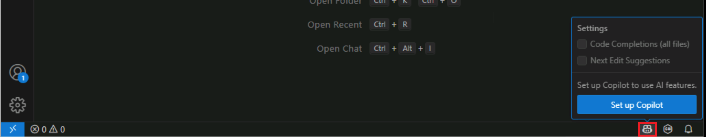

---
lab:
    title: 'Prepare - Enable GitHub Copilot in Visual Studio Code'
    description: 'Complete the steps required to enable GitHub Copilot in Visual Studio Code.'
---

# Enable GitHub Copilot in Visual Studio Code

GitHub offers three GitHub Copilot plans for individual developers and two plans for organizations and enterprises. The plans are designed to meet the needs of individual developers, teams, and organizations. The GitHub Copilot Free plan is available to individual GitHub users, while the paid plans are available to individuals and organizations that require additional features and capabilities.

Complete the following steps to enable GitHub Copilot in Visual Studio Code:

1. Open Visual Studio Code.

1. Ensure that the latest version of Visual Studio Code is installed.

    To check to updates, select **Manage** (the gear icon) in the lower left corner of the Visual Studio Code window, and then select **Check for Updates**.

1. On the Visual Studio Code Status Bar, to activate GitHub Copilot, hover the mouse pointer over the Copilot icon, and then select **Set up Copilot**.

    

1. On the **Sign in to use Copilot for free** page, select **Sign in**.

    The GitHub account sign in page opens in your default web browser.

1. On the GitHub sign in page, enter the GitHub account credentials that you'll be using for this exercise, and then select **Sign in**.

1. Follow the online instructions to authenticate your account and authorize access in Visual Studio Code.

    You'll be directed back to Visual Studio Code when the authentication/authorization process is complete.

1. To verify that GitHub Copilot is activated, open Visual Studio Code's **Extensions** view.

    You should see the GitHub Copilot and GitHub Copilot Chat extensions listed in the **Installed** section of the Extensions view.

    
