---
lab:
    title: 'Exercise - Examine GitHub Copilot settings and user interface features'
    description: 'Learn how to configure GitHub Copilot settings and how to access GitHub Copilot features in Visual Studio Code.'
---

# Examine GitHub Copilot settings and user interface features

Visual Studio Code provides a seamless and customizable GitHub Copilot experience for developers. In this exercise you examine GitHub Copilot settings and explore the GitHub Copilot user interface in Visual Studio Code.

This exercise should take approximately **25** minutes to complete.

> **IMPORTANT**: If you don't have a GitHub account, you can <a href="https://go.microsoft.com/fwlink/?linkid=2320148" target="_blank">sign up</a> for a free individual account and use a GitHub Copilot Free plan to complete this exercise. If you have access to a GitHub Copilot Pro, GitHub Copilot Business, or GitHub Copilot Enterprise subscription from within your lab environment, you can use your existing GitHub Copilot subscription to complete this exercise.

## Before you start

Your lab environment must include the following: Git 2.48 or later, .NET SDK 9.0 or later, Visual Studio Code with the C# Dev Kit extension, and access to a GitHub account with GitHub Copilot enabled.

If you're using a local PC as a lab environment for this exercise:

- For help configuring your local PC as your lab environment, open the following link in a browser: <a href="https://go.microsoft.com/fwlink/?linkid=2320147" target="_blank">Configure your lab environment resources</a>.

- For help enabling your GitHub Copilot subscription in Visual Studio Code, open the following link in a browser: <a href="https://go.microsoft.com/fwlink/?linkid=2320158" target="_blank">Enable GitHub Copilot within Visual Studio Code</a>.

If you're using a hosted lab environment for this exercise:

- For help enabling your GitHub Copilot subscription in Visual Studio Code, paste the following URL into a browser's site navigation bar: <a href="https://go.microsoft.com/fwlink/?linkid=2320158" target="_blank">Enable GitHub Copilot within Visual Studio Code</a>.

- Open a command terminal and then run the following commands:

    To ensure that Visual Studio Code is configured to use the correct version of .NET, run the following command:

    ```bash

    dotnet nuget add source https://api.nuget.org/v3/index.json -n nuget.org

    ```

## Exercise scenario

You're a developer working in the IT department of your local community. The backend systems that support the public library were lost in a fire. Your team needs to develop a temporary solution to help the library staff manage their operations until the system can be replaced. Your team chose GitHub Copilot to accelerate the development process.

This exercise includes the following tasks:

1. Examine GitHub Copilot settings in Visual Studio Code.
1. Explore the GitHub Copilot user interface in Visual Studio Code.

## Examine GitHub Copilot settings in Visual Studio Code

GitHub Copilot settings are split between your GitHub account and the Visual Studio Code environment. In Visual Studio Code, settings enable you to configure the behavior of GitHub Copilot and GitHub Copilot Chat. In your GitHub account, settings enable you to manage your GitHub Copilot subscription, configure the retention of prompts and suggestions, and allow or block suggestions matching public code.

### Enable or disable GitHub Copilot in Visual Studio Code

The GitHub Copilot extensions in Visual Studio Code are enabled by default when you activate a plan. However, you can disable GitHub Copilot in Visual Studio Code for a period of time if you need to.

Use the following steps to complete this section of the exercise:

1. In Visual Studio Code, open the **Extensions** view.

1. In the list of installed extensions, scroll down until you find **GitHub Copilot**.

1. To display a dropdown menu for the GitHub Copilot extension that lists Enable and Disable options, select on the gear icon for the GitHub Copilot extension.

    

If you want to test the enable/disable options, you can select the disable option. However, be sure to re-enable GitHub Copilot before you continue with this exercise.

### Examine settings for the GitHub Copilot extensions

Default settings are configured for you when you activate GitHub Copilot in Visual Studio Code. The settings are organized under the Extensions label, which includes settings for both GitHub Copilot and GitHub Copilot Chat. You can customize settings for the GitHub Copilot extensions using Visual Studio Code's settings tab.

> **TIP**: You can use the Copilot menu to open a Settings tab that's filtered for GitHub Copilot.

Use the following steps to complete this section of the exercise:

1. On Visual Studio Code's top menu bar, open the GitHub Copilot menu.

    The GitHub Copilot menu includes a **Configure Code Completions** option that provides access to a filtered list of GitHub Copilot settings.

    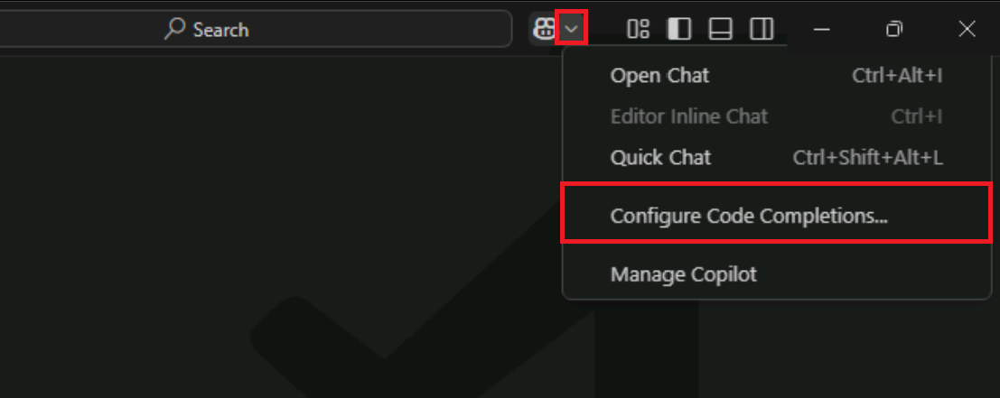

1. On the Copilot menu, select **Configure Code Completions**, and then select **Edit Settings**.

1. Take a moment to review how the GitHub Copilot settings are organized.

    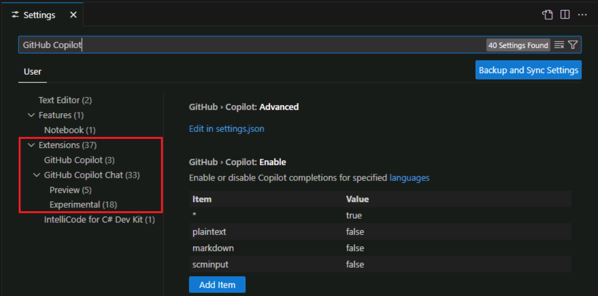

    Notice that the settings for *GitHub Copilot* and *GitHub Copilot Chat* are separated. Also notice the *Preview* and *Experimental* categories.

1. Under the Extensions label, select **GitHub Copilot**.
  
    

    Notice that the settings list is now filtered for GitHub Copilot only.

    The GitHub Copilot extension has the following setting options:

    - **GitHub.Copilot.Advanced**: Configure advanced settings for GitHub Copilot in settings.json.

        Selecting **Edit in settings.json** opens the settings.json file, which is a JSON file that contains the settings for GitHub Copilot. The settings are organized into sections, and each section contains a list of settings.

        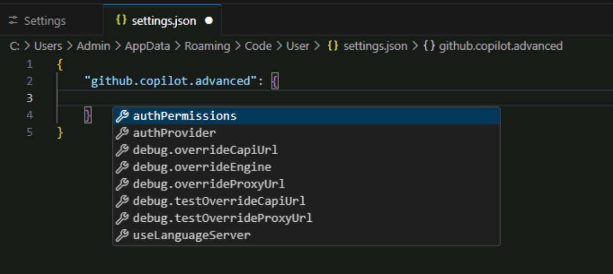

    - **GitHub.Copilot.Enable**: Enable or disable Copilot completions for specified languages.

        The term *languages* refers to programming languages, but accommodates other file formats as well. The languages are specified using a list of languages and a value of **true** or **false** to enable or disable GitHub Copilot for each language. By default, GitHub Copilot is enabled for all languages. This setting is specified with the wildcard character **\*** on the first row and the value **true**. The subsequent rows specify languages for which GitHub Copilot is enabled or disabled. For example, GitHub Copilot is enabled for **C#**, **JavaScript**, and **Python** and disabled for **Plaintext** and **Markdown**.

        

    - **GitHub.Copilot.SelectedCompletionModel**: Select the model to use for Copilot completions.

        You can use the **Change Completions Model** menu option to select a model.

        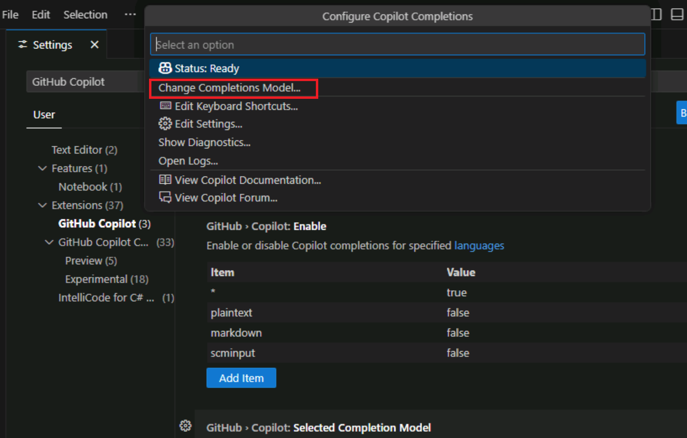

        The list of models may be limited by your GitHub Copilot subscription, the models available in your region, and the models available for your organization.

        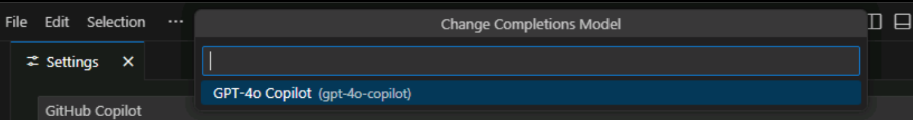

1. Under **Enable or disable Copilot completions for specified languages**, select **markdown**.

    Notice that the value for Markdown is set to **false**. This means that GitHub Copilot is disabled for Markdown files.

1. To enable Copilot for Markdown files, select **Edit Item** (pencil icon), select **false**, change the value to **true**, and then select **OK**.

    You can now use GitHub Copilot to help you author or update Markdown files. For example, GitHub Copilot can suggest descriptions of code files when you're preparing project documentation or update formatting.

1. Under the Extensions label, select GitHub Copilot Chat.

    

    The GitHub Copilot Chat extension has a long list of available settings and it's updated regularly. The GitHub Copilot Chat extension also includes preview and experimental settings that are subject to change and could be discontinued. The preview and experimental settings are included at the end of the list and they're tagged as either **Preview** or **Experimental**.

    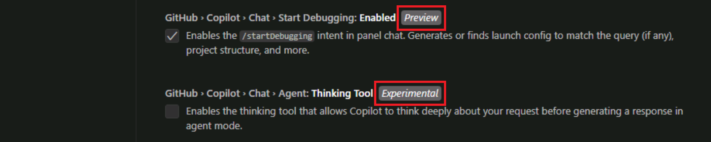

1. Take a few minutes to review the settings for GitHub Copilot Chat.

    We recommend keeping the default settings during this training. This helps to ensure that you have the expected experience when working on the modules in this learning path. When you have completed the training, you can experiment with these settings to customize your experience with GitHub Copilot and Copilot Chat.

1. Close the settings tab.

## Explore the GitHub Copilot user interface in Visual Studio Code

Visual Studio Code seamlessly integrates GitHub Copilot's AI features into your development environment.

GitHub Copilot features align to the following categories:

- Natural language chat: GitHub Copilot provides three distinct chat interfaces: Chat view, Quick Chat, and Inline Chat.

- Code completions: GitHub Copilot integrates with the code editor to generate context-aware code completion suggestions as you type.

- Smart actions: GitHub Copilot automates common tasks with Smart actions to eliminate repetitive prompt writing.

GitHub Copilot's productivity features are easy to access and fit seamlessly into your workflow without interrupting your coding experience.

### Explore the Chat view features

Use the following steps to complete this section of the exercise:

1. To open the Chat view, select the **Toggle Chat** button.

    The Toggle Chat button is located at the top of the Visual Studio Code window, just to the right of the search textbox.

    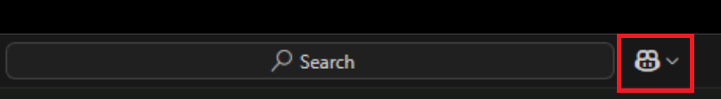

    The GitHub Copilot Chat view opens in a side bar window on the right side of the Visual Studio Code window.

1. Take a few minutes to examine the Chat view interface.

    

    Starting from the top and moving down, the Chat view includes the following interface elements:

    - Chat view toolbar: The Chat view toolbar is located in the top right corner of the Chat view. You can use the toolbar to manage the chat history, start a new chat, open the Chat view in another location, or hide the Chat view. Hover your mouse pointer over the toolbar button icons to see a description.

    - Chat response area: The Chat response area is the space below the Chat view toolbar where GitHub Copilot displays responses. Responses include code suggestions, explanations, interactive elements, and other information related to your prompt.

    - Add Context button: The Add Context button is located in bottom section of the Chat view. You can use this button search for resources that add context to Chat session. The resources can be anything from internal project files to public repositories on GitHub that are external to your organization.

    - Ask Copilot: The Ask Copilot text box is where you enter your prompts. You can use the Ask Copilot text box to ask GitHub Copilot questions about your codebase, request code suggestions, or ask for help with specific tasks.

    - Chat with Extension button: The Chat with Extension button is located below the Ask Copilot textbox. GitHub Copilot Extensions are a type of GitHub App that integrates the power of external tools into GitHub Copilot Chat. You can use this button to select from a list of Copilot Extensions. The default extensions provide a combination of Chat participants and Slash commands that provide context for your prompts.

        > **NOTE**: Anyone with a Copilot Pro, Copilot Pro+, or Copilot Free plan can use Copilot Extensions. For organizations or enterprises with a Copilot Business or Copilot Enterprise plan, organization owners and enterprise administrators can grant access to Copilot Extensions. Copilot Extensions is not available for GitHub Enterprise Server.

    - Start Voice Chat button: The Start Voice Chat button is located below the Ask Copilot textbox. You can use this button to enable or disable voice interactions with GitHub Copilot. When voice interactions are enabled, you can use your voice to ask GitHub Copilot questions or request code suggestions.

    - Chat Mode menu: The Chat Mode dropdown menu is located to the right of the Start Voice Chat button. Based on your specific needs, you can choose between different modes of chat:

        - **Ask**: Use this mode to ask GitHub Copilot questions about your codebase. You can ask GitHub Copilot to explain code, suggest changes, or provide information about the codebase.
        - **Edit**: Use this mode to edit code in your workspace. You can use GitHub Copilot to refactor code, add comments, or make other changes to your code.
        - **Agent**: Use this mode to run GitHub Copilot as an agent. You can use GitHub Copilot to run commands, execute code, or perform other tasks in your workspace.

    - Pick Model menu: The Pick Model menu is located to the right of the Chat Mode menu. You can use this button to select the model that GitHub Copilot uses to generate code suggestions. The default mode is GPT-4o. Model selections may be limited based on your GitHub Copilot subscription, your GitHub Copilot settings, and the models available in your region.

    - Send and Dispatch menu: The Send and Dispatch menu is located to the right of the Pick Model menu. You can use this button to submit your prompt to GitHub Copilot and receive a response. The menu includes several options for how your prompt is submitted.

1. Use the Ask Copilot textbox to enter the following prompt, and then submit the prompt:

    ```text
    Create a C# console app that prints Hello World to the console.
    ```

1. Notice that GitHub Copilot's response includes an interactive list of files and a **Create Workspace** button.

1. To have GitHub Copilot create the code project, select **Create Workspace**.

    GitHub Copilot will prompt you for a parent folder before creating your workspace.

1. In the File dialog, select the **Desktop** folder, and then select **Select as Parent Folder**.

1. When prompted to open the created workspace, select **Open**.

    More advanced prompts can be used to create a workspace with multiple files or to create different project types. For example, you can use the following prompt specify additional conditions for the console app project:

    ```text
    Create a C# console app that prints Hello World to the console. Include a README file and a .gitignore file.
    ```

### Explore the Quick Chat features

The Quick Chat window is a simplified interface for interacting with GitHub Copilot. It provides a quick way to ask questions, request code suggestions, or get help with specific tasks without leaving the code editor.

1. Open the Chat menu and notice that three Chat options are listed.

    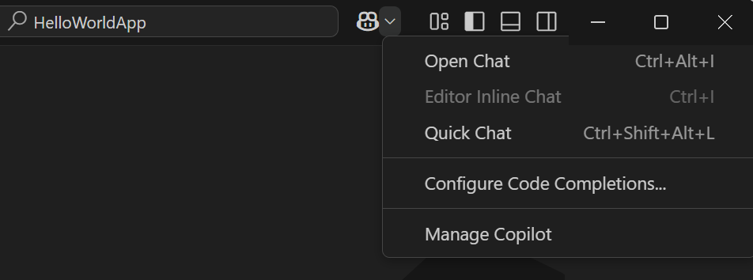

    The three Chat options are:

    - Open Chat: This option is used to open the Chat view.

    - Editor Inline Chat: This option is used to interact with GitHub Copilot directly in the code editor. The Inline Chat option is only enabled when there's a file open in the editor.

    - Quick Chat: This option is used to interact with GitHub Copilot using a simplified interface. You can use quick chat to ask questions, request code suggestions, or get help with specific tasks without leaving the code editor.

1. On the Chat menu, select **Quick Chat**.

    By default, the Quick Chat window opens at the top center of the Visual Studio Code window.

1. Notice that the Quick Chat window provides many of the same options provided with the Chat view.

1. Use the Quick Chat window to submit the following prompt:

    ```text
    Tell me about the Program.cs file
    ```

    Without additional context, the response is likely to be a description of how Program.cs files are used in various project types.

1. To add your Program.cs file to the Quick Chat context, drag-and-drop the Program.cs file from the Explorer view to the top of the Quick Chat window.

1. Notice that the Quick Chat window now includes **Program.cs** to the right of the **Add Context** button.

    > **TIP**: Adding project files to the Chat context (Chat view, Quick Chat, or Inline Chat) helps GitHub Copilot provide more relevant suggestions. When adding project files to the Chat context, it's often easier to use a drag-and-drop operation rather than the Add Context button.

1. Scroll to the top of the Quick Chat window and resubmit the same prompt:

    ```text
    Tell me about the Program.cs file
    ```

1. Notice that the new response describes the contents of your Program.cs file rather than a general description of how Program.cs files are used.

1. In the top-right corner of the Quick Chat window, select **Open in Chat View**.

    Notice that the Quick Chat window closes and the Chat view opens with responses that appeared the Quick Chat window. If the Chat view doesn't display the Quick Chat session, use the Chat menu to open the Quick Chat window, and then select **Open in Chat View**.

    Switching to the Chat view is useful when you need to extend and manage a chat session that started in the Quick Chat window.

    > **TIP**: The Quick Chat window is great for quick questions and simple tasks. However, if you want a more dedicated Chat environment, you should use the Chat view. The Chat view provides a more comprehensive interface for interacting with GitHub Copilot and includes features like chat history, file management, and more advanced options for managing your chat sessions.

### Explore the Inline Chat features

The Inline Chat interface is designed for code interactions directly within the editor. It provides a more focused and streamlined experience for working with code, allowing you to ask questions, request code suggestions, and make edits without leaving the code editor.

1. Open the Program.cs file in the editor.

1. Open the Chat menu and notice the following:

    - The Editor Inline Chat menu option is now enabled.
    - The **Ctrl+I** keyboard shortcut can be used to open an Inline Chat session.

1. In the code editor, select the following code:

    ```csharp

    namespace HelloWorldApp
    {
        class Program
        {
            static void Main(string[] args)
            {
                Console.WriteLine("Hello World");
            }
        }
    }

    ```

1. To open an Inline Chat session, use the keyboard shortcut **Ctrl+I**.

1. Take a minute to examine the Inline Chat interface.

    The Inline Chat interface includes some of the features that you saw in the Chat view and Quick Chat interfaces, but it's designed for code interactions directly within the editor.

1. Enter the following prompt in the Ask Copilot textbox, and then submit the prompt:

    ```text

    refactor using `namespace HelloWorldApp;`

    ```

1. Take a minute to review the response generated by Inline Chat.

    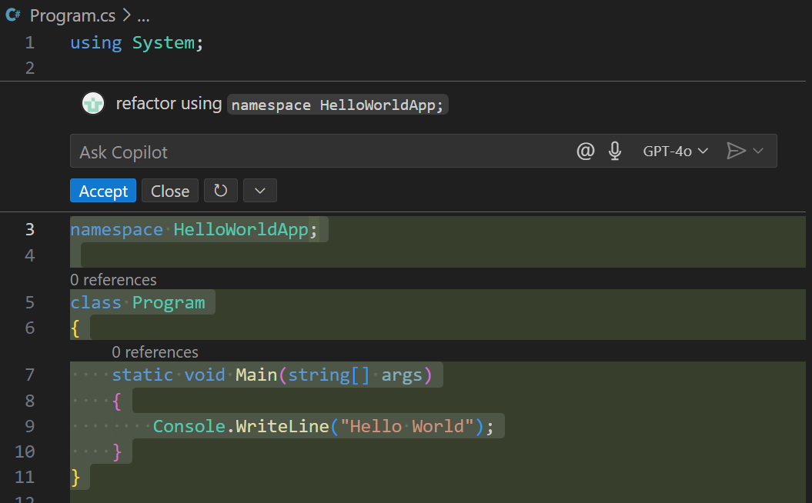

    Notice the following:

    - Inline Chat generates a suggestion by updating the code directly.
    - You can select **Accept** to implement the suggested update, select **Close** to reject the selected update, or select **Rerun** to generate a new suggestion.
    - There is also a **More Actions** menu that provides additional options for managing the Inline Chat session, and you can rate the suggestion as "helpful" or "unhelpful".

1. To accept the suggested code update, select **Accept**.

    The code is updated to use the file-scoped namespace syntax.

### Compare the Chat view's Ask and Edit modes

The Chat view has three modes: **Ask**, **Edit**, and **Agent**. The Ask mode is designed for asking questions and generating code suggestions, while the Edit mode is designed for code refactoring and editing tasks. The Agent mode is designed for running commands and executing code.

1. Ensure that you have the Chat view open in the **Ask** mode.

1. Select the following code:

    ```csharp

    static void Main(string[] args)
    {
        Console.WriteLine("Hello World");
    }

    ```

    Notice that the Chat view context is updated to specify the selected code lines in the Program.cs file.

1. In the Chat view, enter the following prompt:

    ```text

    refactor selection to display "Generate equations for addition and subtraction:"

    ```

1. Take a minute to review response displayed in the Chat view.

    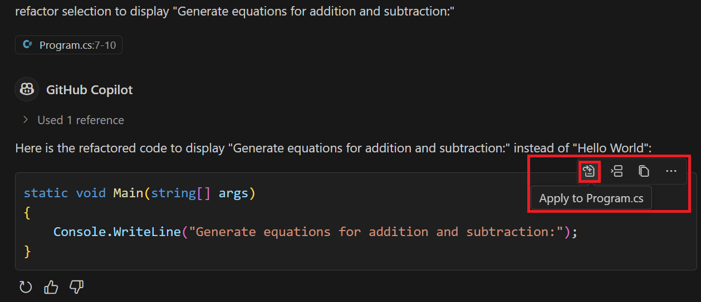

    Notice that when you hover the mouse pointer over the code, the Chat view displays the following options:

    - **Apply to Program.cs**: Use the Apply to Program.cs option to apply the suggested code update to the Program.cs file.
    - **Insert at Cursor**: Use the Insert at Cursor option to insert the suggested code update at the current cursor position in the editor.
    - **Copy**: Use the Copy option to copy the suggested code update to the clipboard.

1. In the Chat view, select **Set Mode**, and then select **Edit**.

1. If a message is displayed telling you that changing the Chat mode terminates the current Chat session, select **Yes** to start a new Chat session, and then resubmit the following prompt:

    ```text

    refactor selection to display "Generate equations for addition and subtraction:"

    ```

1. Take a minute to review the updates suggested in the code editor.

    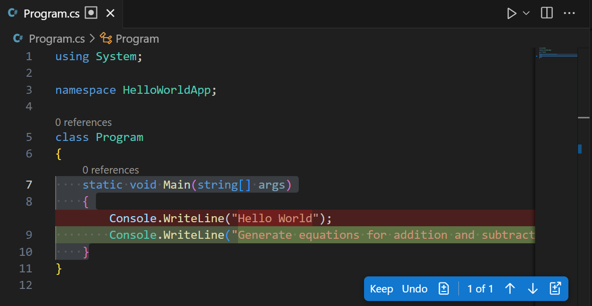

    Notice the following:

    - The code editor displays a *Diff-style* view that shows the changes made to the code, similar to the Diff view used in GitHub pull requests.
    - The code editor displays **Keep** and **Undo** buttons that you can use to apply or reject the changes made to the code.
    - The code editor displays additional buttons that can be used manage the suggested edits.

    In addition to the edit controls displayed the editor tab, the Chat view displays a **Keep** button that you can use to apply all edits and an **Undo** button to cancel the edits, and an abbreviated description of the suggested update.

1. In the Chat view, select **Keep** to apply the suggested code updates, and then select **Done** to end the Chat session.

### Explore code completion suggestions

GitHub Copilot provides code completion suggestions based on the context of the code in the editor. You can use code completion suggestions to quickly generate code snippets, refactor existing code, or implement new features.

1. With the Program.cs file open in the code editor, position the cursor at the end of the Console.WriteLine statement.

1. To generate a code completion suggestion, press **Enter**.

    GitHub Copilot generates a code completion suggestion based on the context of the code in the editor. In this case, GitHub Copilot suggests a new Console.WriteLine statement that's related to generating equations    .

    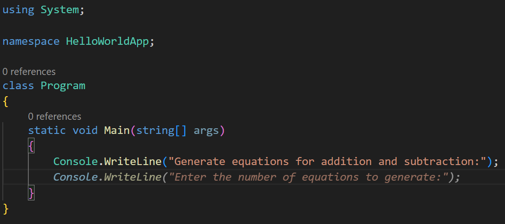

1. To accept the code completion suggestion, press **Tab**.

    The code in the editor is updated to include the new Console.WriteLine statement.

    When you accept a code completion suggestion, GitHub Copilot may suggest additional code lines. When this happens, you can press the **Tab** key to accept the suggestion, press the **Esc** key to reject the suggestion, or enter your own code to override the suggestion.

### Access Smart Actions

Smart Actions are a set of predefined actions that are available from the Copilot context menu. You can use Smart Actions to quickly perform common tasks in Visual Studio Code without having to write prompts.

1. In the code editor, select the Main method, right-click the selected code, and then select **Copilot**.

    You should see a GitHub Copilot context menu that includes three sections.

    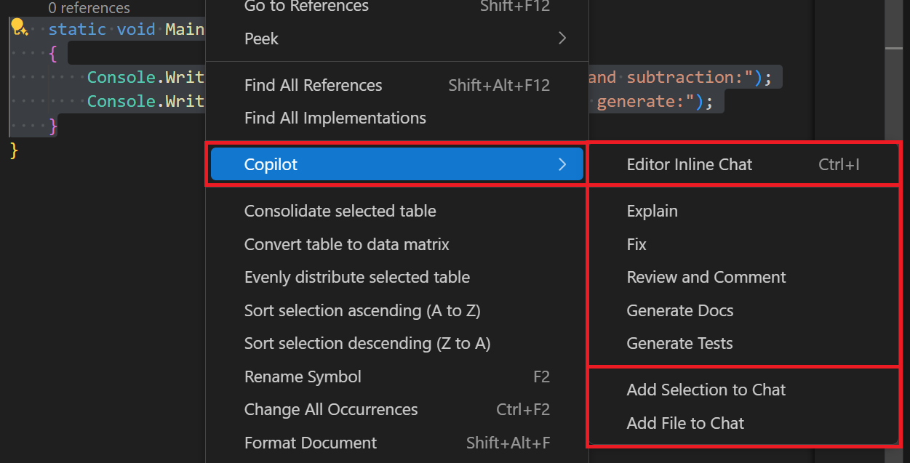

    - The first section includes the option to open an Inline Chat session.
    - The second section includes a list of Smart Actions.
    - The third section includes options for adding context to a Chat session.

1. On the GitHub Copilot context menu, select **Explain**.

1. Take a minute to consider the results of the smart action.

    Notice that the Explain smart action constructs a prompt that's based on the code selection and submits the prompt in the Chat view.

    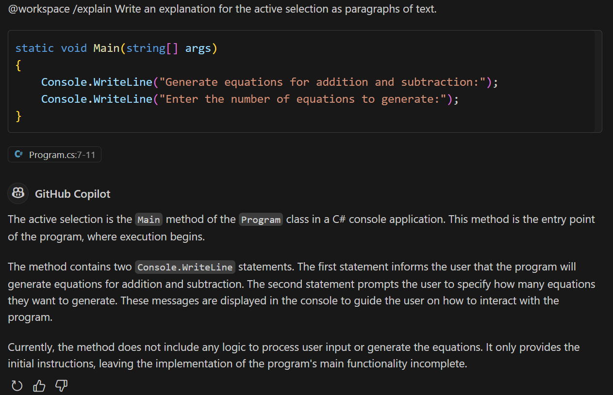

    The explanation includes a detailed description of the selected code, and may include suggested updates.

1. Open the GitHub Copilot context menu again, and then select **Generate Docs**.

1. Take a minute to consider the results of the smart action.

    Notice that the Generate Docs smart action opens an Inline Chat session and submits a prompt asking GitHub Copilot to suggest documentation for the selected code.

    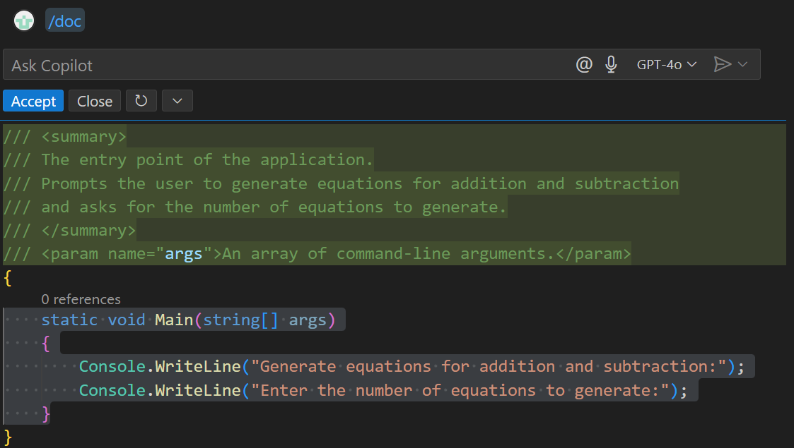

1. In the Inline Chat window, select **Accept** to apply the suggested documentation.

## Summary

In this exercise, you examined GitHub Copilot settings and explored the GitHub Copilot user interface in Visual Studio Code. You learned how to configure GitHub Copilot settings, explore the Chat view, Quick Chat, and Inline Chat features. You also used GitHub Copilot to generate code completions and used Smart Actions to complete common tasks.

## Clean up

Now that you've finished the exercise, take a minute to ensure that you haven't made changes to your GitHub account or GitHub Copilot subscription that you don't want to keep. If you made any changes, revert them now.
