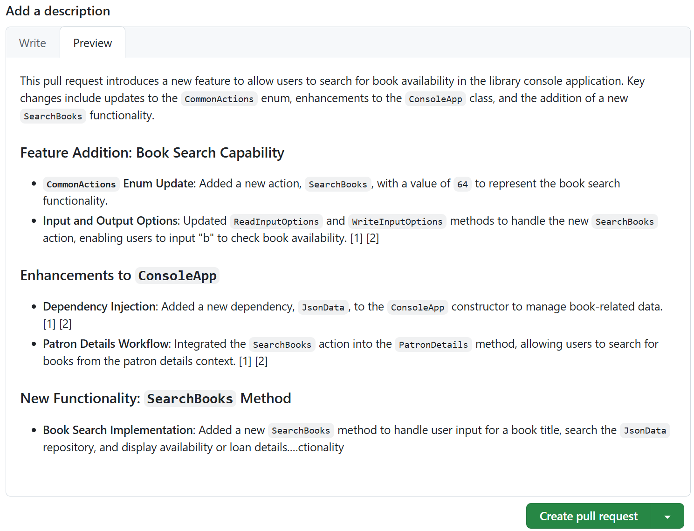

---
lab:
    title: 'Exercise - Develop new code features using GitHub Copilot'
    description: 'Learn how to accelerate the development of new code features using GitHub Copilot in Visual Studio Code.'
---

# Develop new code features using GitHub Copilot

GitHub Copilot's code completion and interactive chat features help developers write code faster and with fewer errors. It provides suggestions for code snippets, functions, and even entire classes based on the context of the code being written. In this exercise, you use GitHub Copilot to accelerate the development of new code features in Visual Studio Code.

This exercise should take approximately **30** minutes to complete.

> **IMPORTANT**: If you don't have a GitHub account, you can <a href="https://go.microsoft.com/fwlink/?linkid=2320148" target="_blank">sign up</a> for a free individual account and use a GitHub Copilot Free plan to complete this exercise. If you have access to a GitHub Copilot Pro, GitHub Copilot Business, or GitHub Copilot Enterprise subscription from within your lab environment, you can use your existing GitHub Copilot subscription to complete this exercise.

## Before you start

Your lab environment must include the following: Git 2.48 or later, .NET SDK 9.0 or later, Visual Studio Code with the C# Dev Kit extension, and access to a GitHub account with GitHub Copilot enabled.

- If you're using your local PC and need help configuring the lab environment, use the following instructions: <a href="https://go.microsoft.com/fwlink/?linkid=2320147" target="_blank">Configure your lab environment resources</a>.

- If you're using a hosted lab environment, or you need help enabling GitHub Copilot within Visual Studio Code, use the following instructions: <a href="https://go.microsoft.com/fwlink/?linkid=2320158" target="_blank">Enable GitHub Copilot within Visual Studio Code</a>.

## Exercise scenario

You're a developer working in the IT department of your local community. The backend systems that support the public library were lost in a fire. Your team needs to develop a temporary solution to help the library staff manage their operations until the system can be replaced. Your team chose GitHub Copilot to accelerate the development process.

An initial version of your library application was tested by end users and several additional features are requested. Your team agreed to work on the following features:

- Book availability: Enable a librarian to determine the availability status of a book. This feature should display a message indicating that a book is available for loan or the return due date if the book is currently on loan to another patron.

- Book loans: Enable a librarian to loan a book to a patron (if the book is available). This feature should display the option for a patron to receive a book on loan, update Loans.json with the new loan, and display updated loan details for the patron.

- Book reservations: Enable a librarian to reserve a book for a patron (unless the book is already reserved). This feature should implement a new book reservation process. This feature may require creating a new Reservations.json file along with the new classes and interfaces required to support the reservation process.

Each team member will work on one of the new features and then regroup. You'll work on the feature to determine the availability status of a book. Your coworker will work on the feature to loan a book to a patron. The final feature, to reserve a book for a patron, will be developed after the other two features are completed.

This exercise includes the following tasks:

1. Set up the library application in Visual Studio Code.

1. Use Visual Studio Code to create a GitHub repository for the library application.

1. Create a "book availability" branch in the code repository.

1. Develop a new "book availability" feature.

    - Use GitHub Copilot suggestions to help implement the code more quickly and accurately.
    - Sync your code updates to the "book availability" branch of your remote repository.

1. Merge your "book availability" updates into the main branch of the repository.

## Set up the library application in Visual Studio Code

You need to download the existing application, extract the code files, and then open the solution in Visual Studio Code.

Use the following steps to set up the library application:

1. To download a zip file containing the library application, select the following URL: [GitHub Copilot lab - develop code features](https://github.com/MicrosoftLearning/mslearn-github-copilot-dev/raw/refs/heads/main/DownloadableCodeProjects/Downloads/AZ2007LabAppM3.zip)

    The zip file is named **AZ2007LabAppM3.zip**.

1. Extract the files from the **AZ2007LabAppM3.zip** file.

    For example:

    1. Navigate to the downloads folder in your lab environment.

    1. Right-click **AZ2007LabAppM3.zip**, and then select **Extract all**.

    1. Select **Show extracted files when complete**, and then select **Extract**.

1. Open the extracted files folder, then copy the **AccelerateDevGHCopilot** folder to a location that's easy to access, such as your Windows Desktop folder.

1. Open the **AccelerateDevGHCopilot** folder in Visual Studio Code.

    For example:

    1. Open Visual Studio Code in your lab environment.

    1. In Visual Studio Code, on the **File** menu, select **Open Folder**.

    1. Navigate to the Windows Desktop folder, select **AccelerateDevGHCopilot** and then select **Select Folder**.

1. In the Visual Studio Code SOLUTION EXPLORER view, verify the following solution structure:

    - AccelerateDevGHCopilot\
        - src\
            - Library.ApplicationCore\
            - Library.Console\
            - Library.Infrastructure\
        - tests\
            - UnitTests\

1. Ensure that the solution builds successfully.

    For example, in the SOLUTION EXPLORER view, right-click **AccelerateDevGHCopilot**, and then select **Build**.

    You'll see some Warnings, but there shouldn't be any Errors.

## Create the GitHub repository for your code

Creating the GitHub repository for your code will enable you to share your work with others and collaborate on the project.

> **NOTE**: You use your own GitHub account to create a private GitHub repository for the library application.

Use the following steps to complete this section of the exercise:

1. Open a browser window and navigate to your GitHub account.

    The GitHub login page is: [https://github.com/login](https://github.com/login).

1. Sign in to your GitHub account.

1. Open your GitHub account menu, and then select **Your repositories**.

1. Switch to the Visual Studio Code window.

1. In Visual Studio Code, open the Source Control view.

1. Select **Publish to GitHub**.

1. Name for the repository **AccelerateDevGHCopilot** and then select **Publish to GitHub private repository**.

    > **NOTE**: If you're not signed in to GitHub in Visual Studio Code, you'll be prompted to sign in. Once you're signed in, authorize Visual Studio Code with the requested permissions.

1. In the Source Control view, enter a commit message, such as "Initial commit", and then select **Publish Branch**.

    If you're prompted to allow a GitHub sign-in:

    1. Select **Allow**, and then follow the prompts to sign in with the GitHub account that you're using for this exercise.
    1. Reselect **Publish to GitHub**.

1. Select **Publish to GitHub public repository**.

1. Notice that Visual Studio Code displays a status messages during the publish process.

    When the publish process is finished, you'll see a message informing you that your code was successfully published to the GitHub repository that you specified.

1. Switch to the browser window for your GitHub account.

1. Open the new AccelerateDevGHCopilot repository in your GitHub account.

    If you don't see your AccelerateDevGHCopilot repository, refresh the page. If you still don't see the repository, try the following steps:

    1. Switch to Visual Studio Code.
    1. Open your notifications (a notification was generated when the new repository was published).
    1. Select **Open on GitHub** to open your repository.

## Create a new branch in the repository

Before you start developing the new "book availability" feature, you need to create a new branch in the repository. This enables you to work on the new feature without affecting the main branch of the repository. You can merge the new feature into the main branch when the code is ready.

Use the following steps to complete this section of the exercise:

1. Ensure that you have the AccelerateDevGHCopilot solution open in Visual Studio Code.

1. Select the Source Control view and ensure that the local repository is synchronized with the remote repository (Pull or Sync).

1. In the bottom-left corner of the window, select **main**.

1. To create a new branch, type **book availability** and then select **+ Create new branch**.

1. To push the new branch to the remote repository, select **Publish Branch**.

## Develop a new "book availability" feature

In this section of the exercise, you use GitHub Copilot to develop a new feature for the library application. The requested feature will enable a librarian to check whether a book is available for loan, a common scenario that isn't currently supported by your current library application.

To implement the book availability feature, you'll need to complete the following updates:

- Add a new **SearchBooks** action to the **CommonActions** enum in CommonActions.cs.

- Update the **WriteInputOptions** method in ConsoleApp.cs.

    - Add support for the new **CommonActions.SearchBooks** option.
    - Display the option to check if a book is available for loan.

- Update the **ReadInputOptions** method in ConsoleApp.cs.

    - Add support for the new **CommonActions.SearchBooks** option.

- Update the **PatronDetails** method in ConsoleApp.cs.

    - Add **CommonActions.SearchBooks** to **options** before calling **ReadInputOptions**.
    - Add an **else if** to handle the **SearchBooks** action.
    - The **else if** block should call a new method named **SearchBooks**.

- Create a new **SearchBooks** method in ConsoleApp.cs.

    - The **SearchBooks** method should read a user provided book title.
    - Check if a book is available for loan, and display a message stating either:

        - "`book.title` is available for loan", or
        - "`book.title` is on loan to another patron. The return due date is `loan.DueDate`."

GitHub Copilot Chat can help you implement the code updates needed to complete the new feature.

- You can use inline chat sessions to implement smaller, more discreet code updates based on your requirements.
- You can use the Chat view to work on larger code updates that may require a more conversational and iterative approach.

### Implement "book availability" updates using inline chat

Inline chat sessions allow you to interact with GitHub Copilot directly in your code editor. You can use inline chat to ask questions, request code suggestions, and get explanations for the code generated by GitHub Copilot.

Use the following steps to complete this section of the exercise:

1. Open the SOLUTION EXPLORER view.

1. Expand the **Library.Console** project.

1. Open the CommonActions.cs file, and then select the **CommonActions** enum.

    You need to add a new **SearchBooks** action to **CommonActions**.

1. Open the inline chat and then enter the following prompt:

    ```plaintext
    Update selection to include a new `SearchBooks` action.
    ```

    GitHub Copilot should suggest a code update that adds the new **SearchBooks** action to the **CommonActions** enum.

1. Review the suggested update and then select **Accept**.

    Your updated code should look similar to the following code snippet:

    ```csharp

    public enum CommonActions
    {
        Repeat = 0,
        Select = 1,
        Quit = 2,
        SearchPatrons = 4,
        RenewPatronMembership = 8,
        ReturnLoanedBook = 16,
        ExtendLoanedBook = 32,
        SearchBooks = 64
    }

    ```

1. Open the ConsoleApp.cs file.

1. Find and then select the **WriteInputOptions** method.

    You need to add support for the new **CommonActions.SearchBooks** option. If the **SearchBooks** option is flagged, display the option to check if a book is available for loan.

1. Open the inline chat and then enter the following prompt:

    ```plaintext
    Update selection to include an option for the `CommonActions.SearchBooks` action. Use the letter "b" and the message "to check for book availability".
    ```

    GitHub Copilot should suggest a code update that adds a new **if** block for the **SearchBooks** action.

1. Review the suggested update and then select **Accept**.

    The suggested update should be similar to the following code snippet:

    ```csharp

    static void WriteInputOptions(CommonActions options)
    {
        Console.WriteLine("Input Options:");
        if (options.HasFlag(CommonActions.ReturnLoanedBook))
        {
            Console.WriteLine(" - \"r\" to mark as returned");
        }
        if (options.HasFlag(CommonActions.ExtendLoanedBook))
        {
            Console.WriteLine(" - \"e\" to extend the book loan");
        }
        if (options.HasFlag(CommonActions.RenewPatronMembership))
        {
            Console.WriteLine(" - \"m\" to extend patron's membership");
        }
        if (options.HasFlag(CommonActions.SearchPatrons))
        {
            Console.WriteLine(" - \"s\" for new search");
        }
        if (options.HasFlag(CommonActions.SearchBooks))
        {
            Console.WriteLine(" - \"b\" to check for book availability");
        }
        if (options.HasFlag(CommonActions.Quit))
        {
            Console.WriteLine(" - \"q\" to quit");
        }
        if (options.HasFlag(CommonActions.Select))
        {
            Console.WriteLine("Or type a number to select a list item.");
        }
    }

    ```

1. Scroll up slightly to find and then select the **ReadInputOptions** method.

    Once again, you need to add support for the new **CommonActions.SearchBooks** option. Include a case that handles the user selecting the **SearchBooks** action.

1. Open the inline chat and then enter the following prompt:

    ```plaintext
    Update selection to include an option for the `CommonActions.SearchBooks` action.
    ```

    GitHub Copilot should suggest an update that adds a new **case** that handles the user selecting the **SearchBooks** action.

1. Review the suggested update and then select **Accept**.

    The suggested update should be similar to the following code snippet:

    ```csharp

    static CommonActions ReadInputOptions(CommonActions options, out int optionNumber)
    {
        CommonActions action;
        optionNumber = 0;
        do
        {
            Console.WriteLine();
            WriteInputOptions(options);
            string? userInput = Console.ReadLine();

            action = userInput switch
            {
                "q" when options.HasFlag(CommonActions.Quit) => CommonActions.Quit,
                "s" when options.HasFlag(CommonActions.SearchPatrons) => CommonActions.SearchPatrons,
                "m" when options.HasFlag(CommonActions.RenewPatronMembership) => CommonActions.RenewPatronMembership,
                "e" when options.HasFlag(CommonActions.ExtendLoanedBook) => CommonActions.ExtendLoanedBook,
                "r" when options.HasFlag(CommonActions.ReturnLoanedBook) => CommonActions.ReturnLoanedBook,
                "b" when options.HasFlag(CommonActions.SearchBooks) => CommonActions.SearchBooks,
                _ when int.TryParse(userInput, out optionNumber) => CommonActions.Select,
                _ => CommonActions.Repeat
            };

            if (action == CommonActions.Repeat)
            {
                Console.WriteLine("Invalid input. Please try again.");
            }
        } while (action == CommonActions.Repeat);
        return action;
    }

    ```

1. Scroll down to find and then select the **PatronDetails** method.

    There are two things that you need to accomplish:

    - You need to add **CommonActions.SearchBooks** to **options** before calling **ReadInputOptions**.
    - You also need to add an **else if** to handle the **SearchBooks** action. The **else if** block should call a new method named **SearchBooks**.

    You can address both requirements with the same prompt.

1. Open the inline chat and then enter the following prompt:

    ```plaintext
    Update selection to add `CommonActions.SearchBooks` to `options` before calling `ReadInputOptions`. Add an `else if` block to handle the `SearchBooks` action. The `else if` block should call a new method named `SearchBooks`.
    ```

    GitHub Copilot should suggest a code update that adds **CommonActions.SearchBooks** to **options** before calling **ReadInputOptions**.

1. Review the suggested update and then select **Accept**.

    ```csharp

    async Task<ConsoleState> PatronDetails()
    {
        Console.WriteLine($"Name: {selectedPatronDetails.Name}");
        Console.WriteLine($"Membership Expiration: {selectedPatronDetails.MembershipEnd}");
        Console.WriteLine();
        Console.WriteLine("Book Loans:");
        int loanNumber = 1;
        foreach (Loan loan in selectedPatronDetails.Loans)
        {
            Console.WriteLine($"{loanNumber}) {loan.BookItem!.Book!.Title} - Due: {loan.DueDate} - Returned: {(loan.ReturnDate != null).ToString()}");
            loanNumber++;
        }

        CommonActions options = CommonActions.SearchPatrons | CommonActions.Quit | CommonActions.Select | CommonActions.RenewPatronMembership | CommonActions.SearchBooks;
        CommonActions action = ReadInputOptions(options, out int selectedLoanNumber);
        if (action == CommonActions.Select)
        {
            if (selectedLoanNumber >= 1 && selectedLoanNumber <= selectedPatronDetails.Loans.Count())
            {
                var selectedLoan = selectedPatronDetails.Loans.ElementAt(selectedLoanNumber - 1);
                selectedLoanDetails = selectedPatronDetails.Loans.Where(l => l.Id == selectedLoan.Id).Single();
                return ConsoleState.LoanDetails;
            }
            else
            {
                Console.WriteLine("Invalid book loan number. Please try again.");
                return ConsoleState.PatronDetails;
            }
        }
        else if (action == CommonActions.Quit)
        {
            return ConsoleState.Quit;
        }
        else if (action == CommonActions.SearchPatrons)
        {
            return ConsoleState.PatronSearch;
        }
        else if (action == CommonActions.RenewPatronMembership)
        {
            var status = await _patronService.RenewMembership(selectedPatronDetails.Id);
            Console.WriteLine(EnumHelper.GetDescription(status));
            // reloading after renewing membership
            selectedPatronDetails = (await _patronRepository.GetPatron(selectedPatronDetails.Id))!;
            return ConsoleState.PatronDetails;
        }
        else if (action == CommonActions.SearchBooks)
        {
            return await SearchBooks();
        }

        throw new InvalidOperationException("An input option is not handled.");
    }

    ```

    > **NOTE**: The code suggested by Inline chat may include stub code for the **SearchBooks** method. You can accept that code. You'll implement the **SearchBooks** method in the next section.

### Implement a SearchBooks method using the Chat view

There's one step remaining to implement the "book availability" updates, create the **SearchBooks** method. The **SearchBooks** method will read a user provided book title, check if a book is available for loan, and display a message indicating the book's availability status. You'll use the Chat view to evaluate the requirements and implement the **SearchBooks** method.

GitHub Copilot's Chat view provides a conversational and interactive environment that isn't available when using inline chat. You can use the Chat view to ask questions, request code suggestions, and get explanations for the code generated by GitHub Copilot. The Chat view supports the following three modes:

- Ask mode: Ask mode is used to gain a better understanding of your codebase, brainstorm ideas, and help with coding tasks. The code suggestions generated in Ask mode can be implemented directly into your codebase or copied to the clipboard.
- Edit mode: Edit mode is used to make changes to your code, such as refactoring or adding new features. Edit mode can make edits across multiple files in your project.
- Agent mode: Agent mode is used to define a high-level task and to start an agentic code editing session to accomplish that task. In agent mode, Copilot autonomously plans the work needed and determines the relevant files and context. The agent can make changes to your code, run tests, and even deploy your application.

You'll be u the Ask and Edit modes to implement the **SearchBooks** method.

Use the following steps to complete this section of the exercise:

1. Take a minute to consider the process requirements for the **SearchBooks** method.

    What's the process that the method needs to complete? What's the return type for this method? Does it require parameters?

    The **SearchBooks** method should implement the following process:

    1. Prompt the user for a book title.
    1. Read the user provided book title.
    1. Check if a book is available for loan.
    1. Display a message stating one of the following options:

        - "`book.title` is available for loan"
        - "`book.title` is on loan to another patron. The return due date is `loan.DueDate`."

    To build the message options, your code will need to access the following JSON files:

    - **Books.json** is needed to find the matching **Title** and **BookId**.
    - **Loans.json** is needed to find the **ReturnDate** and **DueDate** for the matching **BookItemId**. The **BookItemId** is the same as the **BookId** in **Books.json**.

1. Ensure that you have the following **SearchBooks** method created in the ConsoleApp.cs file:

    ```csharp

    async Task<ConsoleState> SearchBooks()
    {

        return ConsoleState.PatronDetails;
    }

    ```

    > **NOTE**: Be sure to remove any code comments created by GitHub Copilot. Unnecessary and inaccurate comments can negatively influence GitHub Copilot's suggestions.

1. Select the `SearchBooks` method.

1. Open the Chat view and then enter the following prompt:

    ```plaintext
    Update selection to obtain a book title. Prompt the user to "Enter a book title to search for". Read the user input and ensure the book title isn't null.
    ```

1. Review the suggested update.

    The suggested update should be similar to the following code snippet:

    ```csharp

    async Task<ConsoleState> SearchBooks()
    {
        string? bookTitle = null;
        while (string.IsNullOrWhiteSpace(bookTitle))
        {
            Console.Write("Enter a book title to search for: ");
            bookTitle = Console.ReadLine();
        }
    
        // Placeholder for further logic to search for the book
        Console.WriteLine($"Searching for the book titled \"{bookTitle}\"...");
    
        return ConsoleState.PatronDetails;
    }

    ```

1. Hover the mouse pointer over the suggested code, and then select **Apply to src\\Library.Console\\ConsoleApp.cs**.

    The suggested code should be visible in the code editor, with options to **Keep** or **Undo**.

1. In the code editor, to accept the suggested code, select **Keep**.

1. Select the **SearchBooks** method.

1. Use drag-and-drop operations to add the following files to the Chat context:

    (from the Library.Console project)
    - ConsoleApp.cs
    - Program.cs
    - Books.json
    - Loans.json
    - BookItems.json

    (from the Library.Infrastructure project)
    - JsonData.cs
    - JsonLoanRepository.cs

1. Enter the following prompt:

    ```plaintext
    @workspace  Explain how to update the `SearchBooks` method and ConsoleApps class to find a matching book title in the `Books.json` file. Use the user supplied book title to find a matching book. If a book is found, use Loans.json to check if the book is available for loan. If the book has been returned, display a message stating "`book.title` is available for loan". If the book is on loan, display a message stating "`book.title` is on loan to another patron. The return due date is `loan.DueDate`".
    ```

1. Take a minute to review the suggested updates.

    Notice the following:

    - The response includes a detailed explanation of the suggested updates.
    - The ConsoleApp class requires a JsonData object to access Books.json and Loans.json. The suggested code uses dependency injection to pass the JsonData object to the ConsoleApp class constructor.
    - The SearchBooks method must be updated with logic that determines the availability of the book title and displays an appropriate message. The suggested code uses LINQ queries to check the loan status.
    - The Program.cs file must be updated to pass the JsonData object to the ConsoleApp class.

    The final section of the response should look similar to the following explanation:

    ```plaintext

    Explanation of Changes

    1. Dependency Injection:
    
        Added JsonData as a dependency to the ConsoleApp constructor to access the JSON data files.

    2. Book Search:
    
        Used FirstOrDefault to find a book in Books.json that matches the user-supplied title (case-insensitive).

    3. Book Item Lookup:
    
        Retrieved the corresponding BookItem using the BookId from BookItems.json.

    4. Loan Check:
    
        Checked Loans.json for an active loan (i.e., a loan with a null ReturnDate) for the BookItem.

    5. Output Messages:
    
        Displayed whether the book is available for loan or currently on loan with the due date.

    Integration in Program.cs

        Ensure that JsonData is registered in the dependency injection container in Program.cs:

    ```

    You can use the Chat view's **Ask** mode to analyze code updates, then use the **Edit** mode to implement the code updates.

1. Use GitHub Copilot's response to construct a new prompt.

    For example, you can use the explanation section to create the following prompt:

    ```plaintext

    Add JsonData as a dependency to the ConsoleApp constructor to access the JSON data files. Use FirstOrDefault to find a book in Books.json that matches the user-supplied title (case-insensitive). Retrieve the corresponding BookItem using the BookId from BookItems.json. Check Loans.json for an active loan (i.e., a loan with a null ReturnDate) for the BookItem. Display whether the book is available for loan or currently on loan with the due date. Ensure that JsonData is registered in the dependency injection container in Program.cs.

    ```

    You can adjust the prompt to achieve specific requirements. For example, if you want a specific message displayed to the end user, you could add your requirement to the prompt:

    ```plaintext

    Add JsonData as a dependency to the ConsoleApp constructor to access the JSON data files. Use FirstOrDefault to find a book in Books.json that matches the user-supplied title (case-insensitive). Retrieve the corresponding BookItem using the BookId from BookItems.json. Check Loans.json for an active loan (i.e., a loan with a null ReturnDate) for the BookItem. Display whether the book is available for loan or currently on loan with the due date. Ensure that JsonData is registered in the dependency injection container in Program.cs. If the book has been returned, display a message stating "`book.title` is available for loan". If the book is on loan, display a message stating "`book.title` is on loan to another patron. The return due date is `loan.DueDate`".

    ```

1. To switch the Chat view to the Edit mode, select **Set Mode**, and then select **Edit**.

    When prompted to start a new session, select **Yes**.

1. Use drag-and-drop operations to add the following files to the Chat context:

    (from the Library.Console project)
    - ConsoleApp.cs
    - Program.cs
    - Books.json
    - Loans.json
    - BookItems.json

    (from the Library.Infrastructure project)
    - JsonData.cs
    - JsonLoanRepository.cs

1. Select the **SearchBooks** method.

1. Enter the following prompt:

    ```plaintext

    Add JsonData as a dependency to the ConsoleApp constructor to access the JSON data files. Use FirstOrDefault to find a book in Books.json that matches the user-supplied title (case-insensitive). Retrieve the corresponding BookItem using the BookId from BookItems.json. Check Loans.json for an active loan (i.e., a loan with a null ReturnDate) for the BookItem. Display whether the book is available for loan or currently on loan with the due date. Ensure that JsonData is registered in the dependency injection container in Program.cs. If the book has been returned, display a message stating "`book.title` is available for loan". If the book is on loan, display a message stating "`book.title` is on loan to another patron. The return due date is `loan.DueDate`".

    ```

1. Take a minute to review the suggested updates in the ConsoleApp.cs file.

    You can use **Previous** and **Next** to navigate through the suggested code updates, or you can scroll manually through the file.

    **ConsoleApp.cs**

    Code updates that add the **JsonData** dependency to the **ConsoleApp** constructor can be found near the top of the ConsoleApp class.

    ```csharp

    JsonData _jsonData;

    public ConsoleApp(ILoanService loanService, IPatronService patronService, IPatronRepository patronRepository, ILoanRepository loanRepository, JsonData jsonData)
    {
        _patronRepository = patronRepository;
        _loanRepository = loanRepository;
        _loanService = loanService;
        _patronService = patronService;
        _jsonData = jsonData;
    }

    ```

    Code updates that check if a book is available for loan can be found in the **SearchBooks** method.

    ```csharp

    async Task<ConsoleState> SearchBooks()
    {
        string? bookTitle = null;
        while (string.IsNullOrWhiteSpace(bookTitle))
        {
            Console.Write("Enter a book title to search for: ");
            bookTitle = Console.ReadLine();
        }

        await _jsonData.EnsureDataLoaded();

        var book = _jsonData.Books!.FirstOrDefault(b => string.Equals(b.Title, bookTitle, StringComparison.OrdinalIgnoreCase));
        if (book == null)
        {
            Console.WriteLine($"No book found with the title \"{bookTitle}\".");
            return ConsoleState.PatronDetails;
        }

        var bookItem = _jsonData.BookItems!.FirstOrDefault(bi => bi.BookId == book.Id);
        if (bookItem == null)
        {
            Console.WriteLine($"No book item found for the title \"{book.Title}\".");
            return ConsoleState.PatronDetails;
        }

        var loan = _jsonData.Loans!.FirstOrDefault(l => l.BookItemId == bookItem.Id && l.ReturnDate == null);
        if (loan == null)
        {
            Console.WriteLine($"\"{book.Title}\" is available for loan.");
        }
        else
        {
            Console.WriteLine($"\"{book.Title}\" is on loan to another patron. The return due date is {loan.DueDate.ToString("d", CultureInfo.InvariantCulture)}.");
        }

        return ConsoleState.PatronDetails;
    }

    ```

    **Program.cs**

    Code to register JsonData and ConsoleApp for dependency injection was already available in the Program.cs file.

    ```csharp

    services.AddSingleton<JsonData>();
    services.AddSingleton<ConsoleApp>();

    ```

1. In the Chat view, to keep all edits, select **Keep**.

1. Scroll to the top of the ConsoleApp.cs file and locate the following code line:

    ```csharp

    JsonData _jsonData;

    ```

1. If JsonData isn't recognized in the ConsoleApp class, add the following using statement above the ConsoleApp class.

    ```csharp
    
    using Library.Infrastructure.Data;
    
    ```

1. Open Visual Studio Code's SOLUTION EXPLORER view.

1. Build the solution and ensure that no errors were introduced by your code updates.

    You'll see Warning messages, but there shouldn't be any errors.

    To build the solution using the SOLUTION EXPLORER view, right-click **AccelerateDevGHCopilot**, and then select **Build**.

## Merge your "book availability" updates into the main branch of the repository

It's important to test your code before merging it into the main branch of the repository. Testing ensures that your code works as expected and doesn't introduce any new issues. In this exercise, you'll use manual testing to verify that the "book availability" feature works as expected.

In this section of the exercise, you complete the following tasks:

1. Test the "book availability" feature.
1. Sync your changes with the remote repository.
1. Create a pull request to merge your changes into the main branch of the repository.

### Test the "book availability" feature

Manual testing can be used to verify that the new feature works as expected. Using a data source that can be verified is important. In this case, you use the **Books.json** and **Loans.json** files to verify that the new feature reports the availability status of a book correctly.

Use the following steps to complete this section of the exercise:

1. To run the application, right-click **Library.Console**, select **Debug**, and then select **Start New Instance**.

1. When prompted for a patron name, type **One** and then press Enter.

    You should see a list of patrons that match the search query.

1. At the "Input Options" prompt, type **2** and then press Enter.

    Entering **2** selects the second patron in the list.

    You should see the patron's name and membership status followed by book loan details.

1. At the "Input Options" prompt, type **b** and then press Enter.

    Entering **b** selects the option to search for a book's availability status.

    You should see a prompt to enter a book title.

1. Type **Book One** and then press Enter.

    In the original data that you downloaded, **Book One** is currently on loan to **Patron Forty-Nine**, so it shouldn't be available.

1. Verify that the application displays a message indicating that the book is on loan to another patron.

1. At the "Input Options" prompt, type **b** and then press Enter.

1. Type **Book Three** and then press Enter.

1. Verify that the application displays a message indicating that the book is available for loan.

1. At the "Input Options" prompt, type **q** and then press Enter.

1. Stop the debug session.

1. Open the **Loans.json** file.

    The Loans.json file is used to track the loan status of each book. You can use the Loans.json file to verify that the availability status of Book One and Book Two is correct.

    The updated Loans.json file should be located in either the **Library.Console\bin\Debug\net8.0\Json** folder or **Library.Console\Json** folder.

    - If you're using the Visual Studio Code debugger to run the app, the updated Loans.json file should be located in the **Library.Console\bin\Debug\net8.0\Json** folder.

    - If you're using a **dotnet run** command from the **AccelerateDevGHCopilot\src\Library.Console** folder to run the app, the updated Loans.json file should be located in the **Library.Console\Json** folder.

1. Verify that loan ID 37 and loan ID 46 are both for Book One (**"BookItemId": 1**).

    - Loan ID 37 should have a **ReturnDate** value of **2024-01-17**, indicating that the book was returned on that date.
    - Loan ID 46 should have a **ReturnDate** value **null**, indicating that the book is currently on loan (loaned on **2024-07-09** but not returned).

    The **ReturnDate** value is used to determine whether the book is currently on loan. If the **ReturnDate** value is **null**, the book is currently on loan.

1. Verify that loan ID 50 is for Book Three (**"BookItemId": 3**) and that the **ReturnDate** value is set to **2023-12-29**.

### Sync your changes with the remote repository

1. Select the Source Control view.

1. Ensure that the files you updated are listed under **Changes**.

    You should see the CommonActions.cs and ConsoleApp.cs files listed under **Changes**.

1. Use GitHub Copilot to generate a message for the **Commit**.

    

1. To stage and commit your changes, select **Commit** and then select **Yes**.

1. To synchronize changes to the remote repository, select **Sync Changes**.

### Create a pull request to merge your changes into the main branch

You've implemented the feature that enables a librarian to determine the availability status of a book. Now you need to merge your changes into the main branch of the repository. You can create a pull request to merge your changes into the main branch.

Use the following steps to complete this section of the exercise:

1. Open your GitHub repository in a web browser.

    To open your GitHub repository from Visual Studio Code:

    1. In the bottom-left corner of of the Visual Studio Code window, select **book-availability**.
    1. On the context menu, to the right of the **book-availability** branch, select the **Open in GitHub** icon.

1. On your GitHub repository page, select the **Compare & pull request** tab.

1. Ensure that **Base** specifies **main**, **compare** specifies **book-availability**, and **Able to merge** is checked.

1. Under **Add a description**, select the Copilot Actions button (the GitHub Copilot icon), and then select the option to generate a summary.

1. Once the summary is generated, select **Preview**.

1. Take a minute to review the summary.

    The generated pull request summary should be similar to the following example:

    

1. Select **Create pull request**.

1. If all checks pass and there are no conflicts with the base branch, select **Merge pull request**, and then select **Confirm merge**.

    Notice that you can delete the **book-availability** branch after merging the changes. To delete the branch, select **Delete branch**.

1. Switch back to the Visual Studio Code window.

1. Switch to the **main** branch of the repository.

1. Open the Source Control view, and then **Pull** the changes from the remote repository.

1. Verify that the book-availability feature is available in the **main** branch.

## Summary

In this exercise, you learned how to use GitHub Copilot to develop a new code feature for a C# application. You developed the feature in a new branch using GitHub Copilot's inline chat and Chat view, tested you code, and then merged your changes into the main branch of the repository. You also used GitHub Copilot to generate a commit message and a pull request summary.

## Clean up

Now that you've finished the exercise, take a minute to ensure that you haven't made changes to your GitHub account or GitHub Copilot subscription that you don't want to keep. If you made any changes, revert them now.
