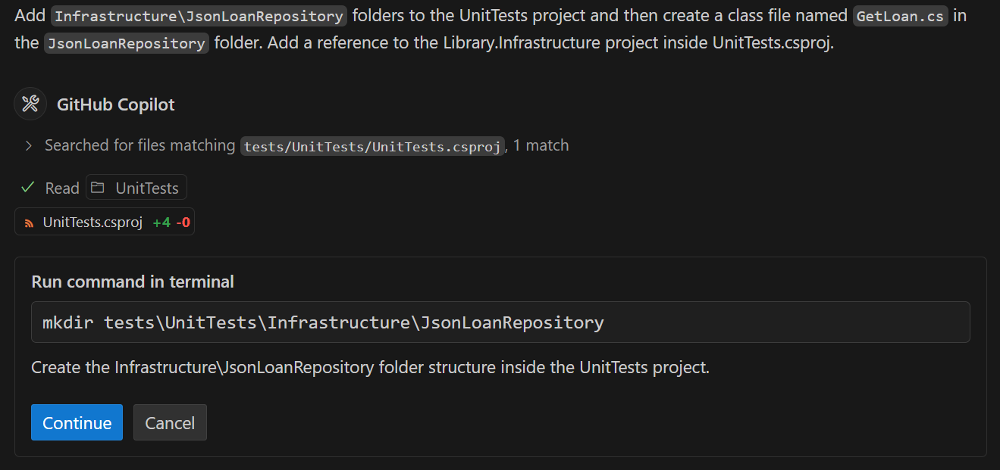
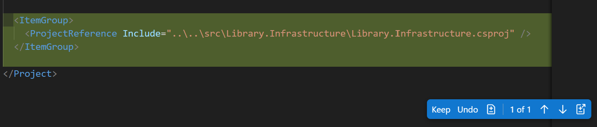

---
lab:
    title: 'Exercise - Develop unit tests using GitHub Copilot'
    description: 'Learn how to accelerate the development of unit tests using GitHub in Visual Studio Code.'
---

# Develop unit tests using GitHub Copilot

The large language models behind GitHub Copilot are trained on a variety of code testing frameworks and scenarios. GitHub Copilot is a great tool for generating test cases, test methods, test assertions and mocks, and test data. In this exercise, you use GitHub Copilot to accelerate the development of unit tests for a C# application.

This exercise should take approximately **25** minutes to complete.

> **IMPORTANT**: If you don't have a GitHub account, you can <a href="https://go.microsoft.com/fwlink/?linkid=2320148" target="_blank">sign up</a> for a free individual account and use a GitHub Copilot Free plan to complete this exercise. If you have access to a GitHub Copilot Pro, GitHub Copilot Business, or GitHub Copilot Enterprise subscription from within your lab environment, you can use your existing GitHub Copilot subscription to complete this exercise.

## Before you start

Your lab environment must include the following: Git 2.48 or later, .NET SDK 9.0 or later, Visual Studio Code with the C# Dev Kit extension, and access to a GitHub account with GitHub Copilot enabled.

- If you're using your local PC and need help configuring the lab environment, use the following instructions: <a href="https://go.microsoft.com/fwlink/?linkid=2320147" target="_blank">Configure your lab environment resources</a>.

- If you're using a hosted lab environment, or you need help enabling GitHub Copilot within Visual Studio Code, use the following instructions: <a href="https://go.microsoft.com/fwlink/?linkid=2320158" target="_blank">Enable GitHub Copilot within Visual Studio Code</a>.

## Exercise scenario

You're a developer working in the IT department of your local community. The backend systems that support the public library were lost in a fire. Your team needs to develop a temporary solution to help the library staff manage their operations until the system can be replaced. Your team chose GitHub Copilot to accelerate the development process.

You have an initial version of the library application that includes a unit test project named UnitTests. You need to accelerate the development of additional unit tests using GitHub Copilot.

This exercise includes the following tasks:

1. Set up the library application in Visual Studio Code.

1. Examine the approach to unit testing implemented by the UnitTests project.

1. Extend the UnitTests project to begin testing the data access classes in the Library.Infrastructure project.

## Set up the library application in Visual Studio Code

You need to download the existing application, extract the code files, and then open the solution in Visual Studio Code.

Use the following steps to set up the library application:

1. To download a zip file containing the library application, select the following URL: [GitHub Copilot lab - develop unit tests](https://github.com/MicrosoftLearning/mslearn-github-copilot-dev/raw/refs/heads/main/DownloadableCodeProjects/Downloads/AZ2007LabAppM4.zip)

    The zip file is named **AZ2007LabAppM4.zip**.

1. Extract the files from the **AZ2007LabAppM4.zip** file.

    For example:

    1. Navigate to the downloads folder in your lab environment.

    1. Right-click **AZ2007LabAppM4.zip**, and then select **Extract all**.

    1. Select **Show extracted files when complete**, and then select **Extract**.

1. Open the extracted files folder, then copy the **AccelerateDevGHCopilot** folder to a location that's easy to access, such as your Windows Desktop folder.

1. Open the **AccelerateDevGHCopilot** folder in Visual Studio Code.

    For example:

    1. Open Visual Studio Code in your lab environment.

    1. In Visual Studio Code, on the **File** menu, select **Open Folder**.

    1. Navigate to the Windows Desktop folder, select **AccelerateDevGHCopilot** and then select **Select Folder**.

1. In the Visual Studio Code SOLUTION EXPLORER view, verify the following solution structure:

    - AccelerateDevGHCopilot\
        - src\
            - Library.ApplicationCore\
            - Library.Console\
            - Library.Infrastructure\
        - tests\
            - UnitTests\

1. Ensure that the solution builds successfully.

    For example, in the SOLUTION EXPLORER view, right-click **AccelerateDevGHCopilot**, and then select **Build**.

    You'll see some Warnings, but there shouldn't be any Errors.

## Examine the approach to unit testing implemented by the UnitTests project

In this section of the exercise, you use GitHub Copilot to examine the unit testing approach implemented by the UnitTests project.

Use the following steps to complete this section of the exercise:

1. Expand the **UnitTests** project in the SOLUTION EXPLORER view.

    Your existing codebase includes a UnitTests project that implements the following folder structure:

    - UnitTests\
      - ApplicationCore\
        - LoanService\
          - **ExtendLoan.cs**
          - **ReturnLoan.cs**
        - PatronService\
          - **RenewMembership.cs**
      - LoanFactory.cs
      - PatronFactory.cs

    The test project structure mirrors and supports the **Services** portion of the **ApplicationCore** project.

    - ApplicationCore\
      - Services\
        - LoanService.cs: Contains the **ExtendLoan** and **ReturnLoan** methods.
        - PatronService.cs: Contains the **RenewMembership** method.

1. Open the Chat view.

1. Add the following files to the Chat context:

    (under the Library.ApplicationCore project)

    - LoanService.cs
    - PatronService.cs

    (under UnitTests project)

    - ExtendLoan.cs
    - ReturnLoan.cs
    - RenewMembership.cs
    - LoanFactory.cs
    - PatronFactory.cs

1. To learn about the existing unit test project, enter the following prompt:

    ```plaintext
    @workspace Explain the approach to unit testing that's been implemented in this workspace.
    ```

    This prompt asks GitHub Copilot to explain the approach to unit testing in the context of the workspace. Adding relevant files to the Chat context improves the response.

1. Take a few minutes to review GitHub Copilot's response.

    You should see a detailed description that's similar to the following example:

    ```markdown

    The unit testing approach in this workspace follows a structured and comprehensive methodology to ensure the correctness of the application's core business logic. Here's an overview of the approach:
    
    1. **Use of Test Factories**
       - Factories like PatronFactory and LoanFactory are used to create test data. These factories provide reusable methods to generate consistent and meaningful test objects, such as patrons with specific membership statuses or loans with different states (e.g., returned, current, expired).
       - This approach reduces boilerplate code in test cases and ensures that test data is consistent across different tests.
    
    2. **Mocking Dependencies**
       - **NSubstitute** is used to mock dependencies like repositories (IPatronRepository, ILoanRepository). This allows tests to isolate the behavior of the services being tested without relying on actual database or external dependencies.
       - Mocked methods are configured to return specific data or simulate certain behaviors, enabling precise control over test scenarios.
    
    3. **Service-Oriented Testing**
       - Unit tests are focused on the core services (PatronService and LoanService), which encapsulate the business logic of the application.
       - Each service method is tested for various scenarios, including success cases, edge cases, and error conditions.
    
    4. **Comprehensive Test Coverage**
       - Tests cover a wide range of scenarios for each service method:
         - **PatronService.RenewMembership:**
           - Success cases (e.g., renewing with or without loans, expired membership).
           - Failure cases (e.g., patron not found, too early to renew, overdue loans).
         - **LoanService.ReturnLoan:**
           - Success cases (e.g., returning a loan with valid conditions).
           - Failure cases (e.g., loan not found, already returned).
         - **LoanService.ExtendLoan:**
           - Success cases (e.g., extending a valid loan).
           - Failure cases (e.g., loan not found, membership expired, loan already returned or expired).
       - This ensures that all possible paths in the business logic are tested.
    
    5. **Assertions for Expected Behavior**
       - Each test uses assertions to validate the expected outcomes:
         - **Return values**: Ensuring the correct status is returned (e.g., MembershipRenewalStatus.Success, LoanReturnStatus.LoanNotFound).
         - **State changes**: Verifying that object properties (e.g., MembershipEnd, ReturnDate, DueDate) are updated correctly.
         - **Error handling**: Ensuring exceptions or errors are handled gracefully.
    
    6. **Descriptive Test Names**
       - Test methods use descriptive names and Fact attributes with DisplayName to clearly indicate the scenario being tested. This improves readability and makes it easier to understand the purpose of each test.
    
    7. **Focus on Business Logic**
       - Tests are designed to validate the business rules implemented in the services, such as:
         - Not allowing membership renewal if it's too early or if there are overdue loans.
         - Preventing loan extensions for expired memberships or already returned loans.
       - This ensures that the core functionality of the application behaves as expected under various conditions.
    
    8. **Error Simulation**
       - Tests simulate error scenarios, such as repository methods returning null or throwing exceptions, to verify that the services handle these cases appropriately.
    
    9. **Constants for Configurable Logic**
       - Constants like LoanService.ExtendByDays are used in the logic and verified in tests to ensure consistency and maintainability.
    
    **Summary**
    This workspace implements a robust unit testing strategy by leveraging test factories, mocking, and comprehensive test coverage. The focus is on isolating and validating the business logic of core services, ensuring that all possible scenarios are accounted for. This approach enhances the reliability and maintainability of the application.

    ```

1. To analyze the benefits of the current approach, enter the following prompt:

    ```plaintext
    @workspace What are the benefits of this approach to unit testing?
    ```

1. Take a minute to review GitHub Copilot's response.

    You can continue the conversation and ask for more details about specific aspects of the unit testing approach. For example, you can ask about the benefits of using test factories, mocking dependencies, or the overall structure of the tests.

1. Take a minute to consider how you would extend the existing approach to test the Library.Infrastructure project.

    The Library.Infrastructure project contains data access classes that interact with the file system to load and save data.

1. Add the following files to the Chat context:

    (under the Library.ApplicationCore project)

    - LoanService.cs
    - PatronService.cs

    (under UnitTests project)

    - ExtendLoan.cs
    - ReturnLoan.cs
    - RenewMembership.cs
    - LoanFactory.cs
    - PatronFactory.cs

1. To ask GitHub Copilot for help extending the UnitTests project, enter the following prompt:

    ```plaintext
    @workspace How can I extend the `UnitTests` project to begin testing methods in the `Library.Infrastructure` project? Provide a process overview.
    ```

    This prompt asks GitHub Copilot to provide a process overview for extending the UnitTests project to begin testing methods in the Library.Infrastructure project. Several files are included in the prompt to provide context for the response.

1. Take a minute to review the response from GitHub Copilot.

    You should see an explanation that's similar to the following example:

    ```markdown
    1. Add Project Reference:

      - Open the UnitTests.csproj file located at tests/UnitTests/UnitTests.csproj.
      - Add a reference to the Library.Infrastructure project.

    2. Identify methods to test:

      - Identify the methods in the `Library.Infrastructure` project that need to be tested. For example, if you want to test the `LoanService` class, identify the methods in the `LoanService` class that need to be tested.

    3. Create Test Classes:

      - Create new test classes in the `tests/UnitTests` directory to test the methods in the `Library.Infrastructure` project. For example, if you want to test `LoanService`, create a file named `LoanServiceTests.cs`.

    4. Write Unit Tests:

      - In the newly created test classes, write unit tests for the methods in the `Library.Infrastructure` project. Use the xUnit framework for writing tests and NSubstitute for mocking dependencies.

    5. Run Tests:

      - Use Visual Studio Code's integrated terminal or the Test Explorer to run the tests.
      - Ensure that the tests are discovered and executed correctly.

    ```

    > **TIP**: Use GitHub Copilot's **Ask** mode to investigate your approach to testing. Use the responses to plan, develop, or extend your unit tests.

## Extend the UnitTests project to begin testing data access classes

The `Library.Infrastructure` project contains data access classes that interact with the file system to load and save data. The project includes the following classes:

- JsonData: A class that loads and saves JSON data.
- JsonLoanRepository: A class that implements the ILoanRepository interface and uses the JsonData class to load and save loan data.
- JsonPatronRepository: A class that implements the IPatronRepository interface and uses the JsonData class to load and save patron data.

### Use Agent mode to create a new test class

You can use the Chat view's Agent mode when you have a specific task in mind and want to enable Copilot to autonomously edit your code. For example, you can use Agent mode to create and edit files, or to invoke tools to accomplish tasks. In Agent mode, GitHub Copilot can autonomously plan the work needed and determine the relevant files and context. It then makes edits to your codebase and invokes tools to accomplish the request you made.

> **NOTE**: The Agent mode is only available in Visual Studio Code. If you're using GitHub Copilot in a different environment, you can use the Chat mode to accomplish similar tasks.

In this section of the exercise, you use GitHub Copilot's Agent mode to create a new test class for the GetLoan method of the JsonLoanRepository class.

Use the following steps to complete this section of the exercise:

1. In the Chat view, select the **Set Mode** button, and then select **Agent**.

1. To start an automated task that creates a test class for the JsonLoanRepository.GetLoan method, enter the following prompt:

    ```plaintext
    Add `Infrastructure\JsonLoanRepository` folders to the UnitTests project and then create a class file named `GetLoan.cs` in the `JsonLoanRepository` folder. Add a reference to the Library.Infrastructure project inside UnitTests.csproj.
    ```

    This prompt asks GitHub Copilot to create a new folder structure and class file in the UnitTests project.

    - UnitTests\
      - Infrastructure\
        - JsonLoanRepository\
          - GetLoan.cs

    The prompt also asks GitHub Copilot to add a reference to the Library.Infrastructure project inside the UnitTests.csproj file.

1. Take a minute to review the response from GitHub Copilot.

    Notice the following updates in the Chat view and code editor:

    - The Chat view displays a message indicating that it wants to run a command in the terminal:

        

    - The UnitTests.csproj file is open in the code editor with the following changes:

        

1. In the Chat view, to run the command in the terminal, select **Continue**.

    When you select **Continue**, GitHub Copilot completes the following actions:

    - Runs the mkdir command in the terminal to create the `Infrastructure\JsonLoanRepository` folders in the UnitTests project.
    - Creates a new file named `GetLoan.cs` in the `JsonLoanRepository` folder.

1. Take a moment to review the updates.

1. In the Chat view, to accept all changes, select **Keep**, and then select **Done**.

1. In the SOLUTION EXPLORER view, expand the `Infrastructure\JsonLoanRepository` folder structure.

    The folder structure should look like this:

    - UnitTests\
      - Infrastructure\
        - JsonLoanRepository\
          - GetLoan.cs

### Use the Edit mode to create unit tests for the GetLoan method

In this section of the exercise, you use GitHub Copilot's Edit mode to create unit tests for the `GetLoan` method in the `JsonLoanRepository` class.

Use the following steps to complete this section of the exercise:

1. In the Chat view, select the **Set Mode** button, and then select **Edit**.

    The Chat view is now in Edit mode.

1. Open the `JsonLoanRepository.cs` file.

    `JsonLoanRepository.cs` is located in the `src/Library.Infrastructure/Data/` folder.

1. Take a minute to review the `JsonLoanRepository.cs` file.

    ```csharp
    using Library.ApplicationCore;
    using Library.ApplicationCore.Entities;
    
    namespace Library.Infrastructure.Data;
    
    public class JsonLoanRepository : ILoanRepository
    {
        private readonly JsonData _jsonData;
    
        public JsonLoanRepository(JsonData jsonData)
        {
            _jsonData = jsonData;
        }
    
        public async Task<Loan?> GetLoan(int id)
        {
            await _jsonData.EnsureDataLoaded();
    
            foreach (Loan loan in _jsonData.Loans!)
            {
                if (loan.Id == id)
                {
                    Loan populated = _jsonData.GetPopulatedLoan(loan);
                    return populated;
                }
            }
            return null;
        }
    
        public async Task UpdateLoan(Loan loan)
        {
            Loan? existingLoan = null;
            foreach (Loan l in _jsonData.Loans!)
            {
                if (l.Id == loan.Id)
                {
                    existingLoan = l;
                    break;
                }
            }
    
            if (existingLoan != null)
            {
                existingLoan.BookItemId = loan.BookItemId;
                existingLoan.PatronId = loan.PatronId;
                existingLoan.LoanDate = loan.LoanDate;
                existingLoan.DueDate = loan.DueDate;
                existingLoan.ReturnDate = loan.ReturnDate;
    
                await _jsonData.SaveLoans(_jsonData.Loans!);
    
                await _jsonData.LoadData();
            }
        }
    }
    ```

1. Notice the following details about the `JsonLoanRepository` class:

    - The `JsonLoanRepository` class contains two methods: `GetLoan` and `UpdateLoan`.
    - The `JsonLoanRepository` class uses a `JsonData` object to load and save loan data.

1. Take a minute to consider the field and constructor requirements for the `GetLoan` test class.

    The `JsonLoanRepository.GetLoan` method receives a loan ID parameter when it's called. The method uses `_jsonData.EnsureDataLoaded` to get the latest JSON data, and `_jsonData.Loans` to search for a matching loan. If the method finds a matching loan ID, it returns a populated loan object (`populated`). If the method is unable to find a matching loan ID, it returns `null`.

    For the GetLoan unit tests:

    - You can use a mock loan repository object (`_mockLoanRepository`) to help test the case where a matching ID is found. Load the mock with the ID you want to find. The `ReturnLoanTest` class demonstrates how to mock the `ILoanRepository` interface and instantiate a mock loan repository object.

    - You can use a non-mock loan repository object (`_jsonLoanRepository`) to test the case where no matching ID is found. Just specify a loan ID that you know isn't in the file (anything over 100 should work).

    - You'll need a `JsonData` object to create a non-mock `JsonLoanRepository` object. Since the `UnitTests` project doesn't have access to the `JsonData` object created by the `ConsoleApp` project, you'll need to create one using the `IConfiguration` interface.

1. Open the GetLoan.cs test file and select the GetLoan class.

1. Add the following files to the Chat context:

    - JsonLoanRepository.cs
    - ReturnLoan.cs
    - LoanService.cs
    - LoanFactory.cs
    - JsonData.cs

1. Enter the following prompt:

    ```plaintext
    @workspace Create fields and a class constructor for the `GetLoan.cs` file. The class will be used to create unit tests for the GetLoan method in the `JsonLoanRepository.cs` file. Create the following private readonly fields: `_mockLoanRepository`, `_jsonLoanRepository`, `_configuration`, and `_jsonData`. Instantiate the fields in the `GetLoanTest` constructor. Use `ConfigurationBuilder` to create a `_configuration` object that can be used to instantiate the JsonData object.
    ```

    This prompt asks GitHub Copilot to suggest fields and a class constructor.

1. Take a minute to review the response from GitHub Copilot.

    You may see a code suggestion that's similar to the following code snippet:

    ```csharp
    using NSubstitute;
    using Library.ApplicationCore;
    using Library.ApplicationCore.Entities;
    using Library.ApplicationCore.Interfaces;
    using Library.Infrastructure.Data;
    using Microsoft.Extensions.Configuration;
    
    namespace UnitTests.Infrastructure.JsonLoanRepository;
    
    public class GetLoanTest
    {
        private readonly ILoanRepository _mockLoanRepository;
        private readonly JsonLoanRepository _jsonLoanRepository;
        private readonly IConfiguration _configuration;
        private readonly JsonData _jsonData;
    
        public GetLoanTest()
        {
            _mockLoanRepository = Substitute.For<ILoanRepository>();
            _configuration = new ConfigurationBuilder()
                .AddJsonFile("appsettings.json")
                .Build();
            _jsonData = new JsonData(_configuration);
            _jsonLoanRepository = new JsonLoanRepository(_jsonData);
        }
    
        // Add test methods here
    }
    ```

1. In the Chat view, to accept all updates, select **Keep**.

1. After accepting the updates, check for the following issues:

    > **NOTE**: Sample code in the following step shows updates that correct the following issues:
  
    - If there's a conflict between the `UnitTests.Infrastructure.JsonLoanRepository` namespace and the `JsonLoanRepository` type specified in the code, you should update the namespace in GetLoans.cs to eliminate the conflict. The pattern used in the `ReturnLoan.cs` and `RenewMembership.cs` files.

    - If `ILoanRepository` isn't recognized in your code, you may need to add a `using` directive for `Library.ApplicationCore` to the top of the file.

    - If the `_configuration` object isn't instantiated correctly, you may need to update the code line containing `ConfigurationBuilder`. You can simplify the code to use `_configuration = new ConfigurationBuilder().Build();`.

    - If a `using Library.ApplicationCore.Interfaces` is suggested by GitHub Copilot, you can delete it from the top of the file.

1. Update the `GetLoan.cs` file to match the following code snippet:

    ```csharp
    using NSubstitute;
    using Library.ApplicationCore;
    using Library.ApplicationCore.Entities;
    using Library.Infrastructure.Data;
    using Microsoft.Extensions.Configuration;
    
    namespace UnitTests.Infrastructure.JsonLoanRepositoryTests;
    
    public class GetLoanTest
    {
        private readonly ILoanRepository _mockLoanRepository;
        private readonly JsonLoanRepository _jsonLoanRepository;
        private readonly IConfiguration _configuration;
        private readonly JsonData _jsonData;
    
        public GetLoanTest()
        {
            _mockLoanRepository = Substitute.For<ILoanRepository>();
            _configuration = new ConfigurationBuilder().Build();
            _jsonData = new JsonData(_configuration);
            _jsonLoanRepository = new JsonLoanRepository(_jsonData);
        }
    
    }
    ```

1. Add the following files to the Chat context:

    - JsonLoanRepository.cs
    - ReturnLoan.cs
    - LoanService.cs
    - LoanFactory.cs
    - JsonData.cs
    - Loans.json.

1. Select the contents of the `GetLoan.cs` file, and then enter the following prompt in the Chat view:

    ```plaintext
    @workspace Update the selection to include a unit test for the `JsonLoanRepository.GetLoan` method. The unit test should test the case where a loan ID is found in the data. Use `_mockLoanRepository` to arrange the expected return loan. Use `_jsonLoanRepository` to return an actual loan. Asserts should verify that the return loan ID matches the expected loan ID. Use a loan ID that exists in the `Loans.json` file.
    ```

    This prompt asks GitHub Copilot to suggest a unit test for the `JsonLoanRepository.GetLoan` method. The unit test should test the case where a loan ID is found in the data. The test should use `_mockLoanRepository` to arrange the expected return loan, `_jsonLoanRepository` to return an actual loan, and asserts to verify that the return loan ID matches the expected loan ID. The loan ID should exist in the `Loans.json` file.

1. Take a minute to review the updates suggested by GitHub Copilot.

    You should see a code suggestion that's similar to the following code snippet:

    ```csharp
    using NSubstitute;
    using Library.ApplicationCore;
    using Library.ApplicationCore.Entities;
    using Library.Infrastructure.Data;
    using Microsoft.Extensions.Configuration;
    using Xunit;
    
    namespace UnitTests.Infrastructure.JsonLoanRepositoryTests;
    
    public class GetLoanTest
    {
        private readonly ILoanRepository _mockLoanRepository;
        private readonly JsonLoanRepository _jsonLoanRepository;
        private readonly IConfiguration _configuration;
        private readonly JsonData _jsonData;
    
        public GetLoanTest()
        {
            _mockLoanRepository = Substitute.For<ILoanRepository>();
            _configuration = new ConfigurationBuilder().Build();
            _jsonData = new JsonData(_configuration);
            _jsonLoanRepository = new JsonLoanRepository(_jsonData);
        }
    
        [Fact(DisplayName = "JsonLoanRepository.GetLoan: Returns loan when loan ID is found")]
        public async Task GetLoan_ReturnsLoanWhenLoanIdIsFound()
        {
            // Arrange
            var loanId = 1; // Use a loan ID that exists in the Loans.json file
            var expectedLoan = new Loan
            {
                Id = loanId,
                BookItemId = 17,
                PatronId = 22,
                LoanDate = DateTime.Parse("2023-12-08T00:40:43.1808862"),
                DueDate = DateTime.Parse("2023-12-22T00:40:43.1808862"),
                ReturnDate = null
            };

            _mockLoanRepository.GetLoan(loanId).Returns(expectedLoan);

            // Act
            var actualLoan = await _jsonLoanRepository.GetLoan(loanId);
    
            // Assert
            Assert.NotNull(actualLoan);
            Assert.Equal(expectedLoan.Id, actualLoan?.Id);
        }
    }
    ```

1. In the Chat view, to accept all updates, select **Keep**.

    If the `Loan` class isn't recognized in your code, ensure that you have a `using Library.ApplicationCore.Entities;` statement at the top of the GetLoan.cs file. The `Loan` class is located in the `Library.ApplicationCore.Entities` namespace.

1. Build the `AccelerateDevGitHubCopilot` solution to ensure there are no errors.

1. Use GitHub Copilot's autocompletion feature to create a test for the case where the loan ID isn't found.

    Create a blank line after the `GetLoan_ReturnsLoanWhenLoanIdIsFound` method.

    Accept the autocompletion suggestions to create a new test method.

    > **NOTE**: Code completions may appear one line at a time. You may need to press **Tab** or **Enter** several times to get the completed unit test code.

1. Take a minute to review the new unit text.

    You should see a suggested unit text that's similar to the following code snippets:

    ```csharp

        [Fact(DisplayName = "JsonLoanRepository.GetLoan: Returns null when ID is not found")]
        public async Task GetLoan_ReturnsNullWhenIdIsNotFound()
        {
            // Arrange
            var loanId = 999; // Loan ID that does not exist in Loans.json

            _mockLoanRepository.GetLoan(loanId).Returns((Loan?)null);

            // Act
            var actualLoan = await _jsonLoanRepository.GetLoan(loanId);

            // Assert
            Assert.Null(actualLoan);
        }

    ```

    GitHub Copilot's autocompletion feature may mock an expected loan even though it isn't needed, so you could get the following code snippet:

    ```csharp
    [Fact(DisplayName = "JsonLoanRepository.GetLoan: Returns null when loan ID is not found")]
    public async Task GetLoan_ReturnsNullWhenLoanIdIsNotFound()
    {
        // Arrange
        var loanId = 999; // Use a loan ID that does not exist in the Loans.json file
        var expectedLoan = new Loan { Id = loanId, BookItemId = 101, PatronId = 202, LoanDate = DateTime.Now, DueDate = DateTime.Now.AddDays(14) };
        _mockLoanRepository.GetLoan(loanId).Returns(expectedLoan);

        // Act
        var actualLoan = await _jsonLoanRepository.GetLoan(loanId);

        // Assert
        Assert.Null(actualLoan);
    }

    ```

    You can delete the code that mocks an expected loan, but you need a loan ID that doesn't exist in the `Loans.json` file.

    Ensure that your "Returns null when loan ID is not found" unit test assigns a `loanId` value that isn't in the data set.

1. Notice that the unit tests require access to the JSON data files.

    The `JsonLoanRepository.GetLoan` method uses a `JsonData` object to load and save loan data.

    The JSON data files are located in the `Library.Console\Json` folder. You need to update the `UnitTests.csproj` file to include these files in the test project.

1. Add the following XML snippet to the `UnitTests.csproj` file:

    ```xml
    <ItemGroup>
        <None Include="..\..\src\Library.Console\Json\**\*">
            <Link>Json\%(RecursiveDir)%(FileName)%(Extension)</Link>
            <CopyToOutputDirectory>PreserveNewest</CopyToOutputDirectory>
        </None>
    </ItemGroup>
    ```

    This ensures that the JSON data files are copied to the output directory when the tests are run.

## Run the unit tests

There are several ways to run the unit tests for the `JsonLoanRepository` class. You can use Visual Studio Code's Test Explorer, the integrated terminal, or the `dotnet test` command.

Use the following steps to complete this section of the exercise:

1. Ensure that you have the GetLoans.cs file open in editor.

1. Build the solution and ensure that there are no errors.

    Right-click **AccelerateDevGitHubCopilot** and then select **Build**.

1. Notice the "green play button" to the left of the test methods.

1. Open Visual Studio Code's Test Explorer view.

    To open the Test Explorer view, select the beaker-shaped icon on the left-side Activity bar. The Test Explorer is labeled "Testing" in the user interface.

    The Test Explorer is a tree view that shows all the test cases in your workspace. You can run/debug your test cases and view the test results using Test Explorer.

1. Expand **UnitTests** and the underlying nodes to locate `GetLoanTest`.

1. Run the **JsonLoanRepository.GetLoan: Returns loan when loan ID is found** test case.

1. Notice that the test results are displayed in the Test Explorer view and the code Editor.

    You should see a green checkmark that indicates the test passed.

1. Use the code Editor to run the **JsonLoanRepository.GetLoan: Returns null when loan ID is not found** test case.

    To run the test from the code Editor, select the green play button to the left of the test method.

    Notice that the test results are displayed in the Test Explorer view and the code Editor.

    Ensure that the **JsonLoanRepository.GetLoan: Returns null when loan ID is not found** test passes. You should see a green checkmark to the left of both tests.

## Summary

In this exercise, you learned how to use GitHub Copilot to accelerate the development of unit tests in a C# application. You used GitHub Copilot's Chat view in Ask mode, Agent mode, and Edit mode. You used Ask mode to examine the existing unit testing approach, Agent mode to create project folders and a new test class, and Edit mode to create unit tests. You also used GitHub Copilot's code completion feature to create a unit test.

## Clean up

Now that you've finished the exercise, take a minute to ensure that you haven't made changes to your GitHub account or GitHub Copilot subscription that you don't want to keep. If you made any changes, revert them now.
